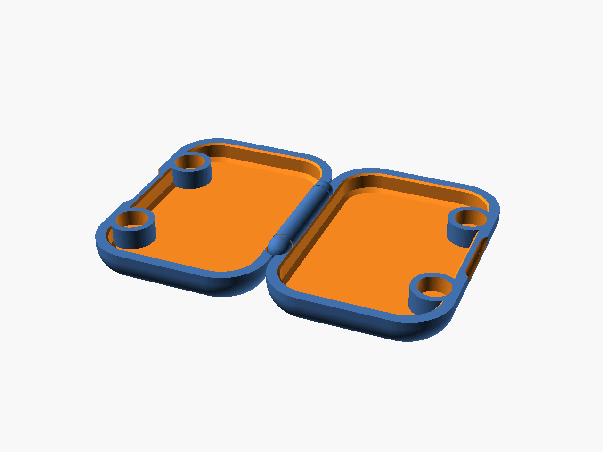
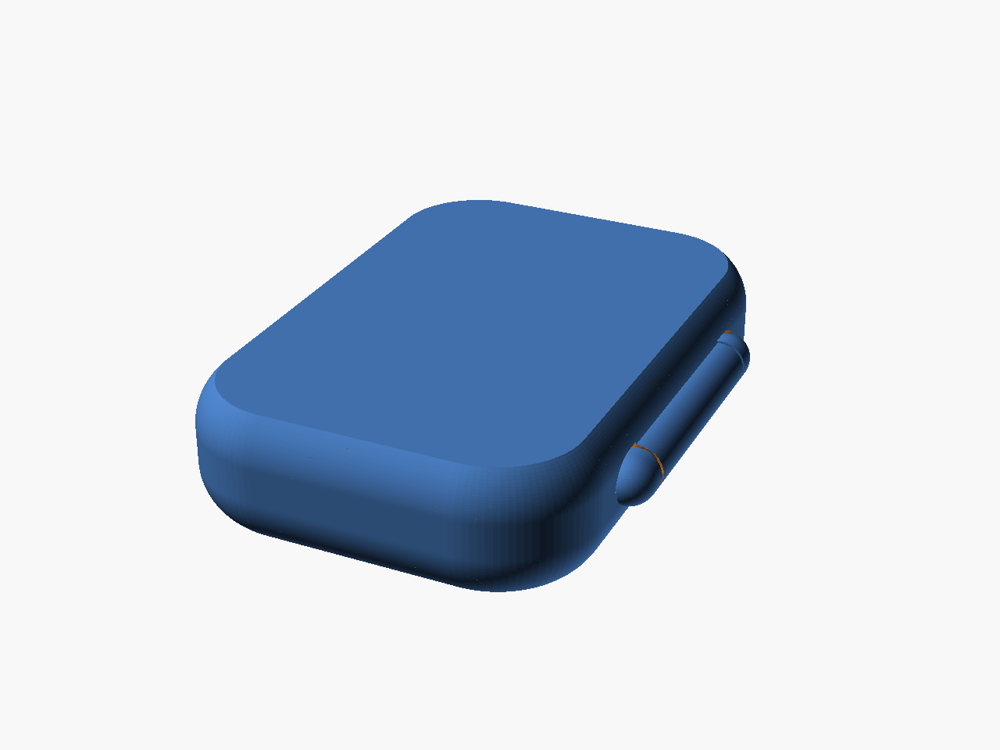

# Pocket Clamshell Case — hollow "tic tac" version

`scad/tictac_case.scad` → `stl/tictac_case.stl`

A rework of the 6 mm-magnet clamshell (`case_6mm.stl`) into a plain pocket
container for tic tacs. The parts that give it its character — the
print-in-place pin hinge, the Ø6 magnet snap, the rolled pebble exterior and
the thumb scoop — are carried over unchanged. The shaped tool pockets are gone
and it is shorter and much flatter.




## What changed

| | original | this |
|---|---|---|
| Length | 60 mm | **50 mm** |
| Closed height | 15.2 mm | **11.0 mm** |
| Width (excl. hinge) | 35 mm | 35 mm |
| Interior | shaped tool pockets, retaining post, 2 tool-holding magnets | **plain open box** |
| Closure magnets | 1 pair | **2 pairs** |
| Magnet pocket | Ø6.30 × 3.2 deep | unchanged |
| Hinge | Ø2.30 pin, Ø4.30 barrel | unchanged |

Closed it is **50 × 35 × 11 mm**, plus the 2.4 mm the hinge barrel stands
proud of the spine (37.4 mm over the hinge). Interior capacity ≈ 10 cm³ —
roughly two-thirds of a shop tic tac box. About 9 g of PLA.

The original carried four magnets: one closure pair, plus two more sunk in the
pocket floor to grip the steel tool it was built around. Those two are useless
for sweets, so the count is reused as a **second closure pair** — same four
magnets per case, twice the snap, and it can't be twisted open from one end.

## Keeping the feel

The exterior is the original's construction, not an approximation of it: a flat
bottom, a circular-arc roll up the flank, then a short straight band to the
parting line. The original's arc is r = 7.107 turning vertical 2.18 mm below
the rim; both are scaled by the height change (5.5/7.6) to r = 5.14 at
3.92 mm, so the silhouette stays proportionally identical instead of going
slab-sided. Plan corner radius (9 mm), wall (2.45 mm), floor (1.4 mm), rim
chamfer (0.4 mm) are all as measured.

The thumb divot is the original's exact construction: a **capsule lying along
the rim line** — a rod of radius 2.766 with its axis *on* the parting plane,
sunk 0.989 mm into the flank, with a 10.098 mm straight run. Fitted to the
original at 0.04 mm RMS over its full depth. It matters that it is a capsule
and not a dish: it gives a flat-bottomed groove 14.34 mm long that a thumb pad
sits in, rather than a lens that a thumb skates off.

The hinge is reproduced dimension for dimension off the original, and every
number below was measured back off `case_6mm.stl` rather than chosen:

| | original | here |
|---|---|---|
| pin | r 1.150 | 1.15 |
| barrel outer | r 2.149 | 2.15 |
| pin ↔ barrel bore | 0.200 mm | 0.200 |
| barrel ↔ facing shell | 0.249 mm | 0.250 |
| barrel ring length | 19.40 mm | 19.35 |
| axial gap ring ↔ knuckle | 0.35 / 0.30 | 0.30 |
| overall hinge length | 27.30 mm | 27.20 |

The knuckle tips are **ellipsoidal, running out over 2.50 mm** — not
hemispherical. That one detail is what sets the overall length: capping a
2.15 mm barrel with hemispheres instead stretches the hinge to 31.3 mm.

The pin half and the barrel half are the same tray mirrored about the pivot, so
the two shells and their magnets line up exactly when it shuts.

## Printing

Print **as exported** — laid open flat, both cavities up, hinge in place. No
supports.

- 0.2 mm layers, 3 walls, 15 % infill, PLA or PETG.
- The barrel bridges over the pin on one layer; that gap is the original's
  0.20 mm and wants no ironing or elephant-foot compensation on the first
  layer. If your printer squashes it shut, raise `pin_clr` to 0.25.
- **4 × Ø6 × 3 mm disc magnets.** Press them into the four rim pockets after
  printing. Check the polarity across the closed case before gluing — the
  pairs must attract, and the two pairs must agree with each other. A drop of
  CA once you're sure; they sit 0.2 mm below the rim so the shells still meet
  face to face.
- Work the hinge loose with a fingernail before the first full close.

## Parameters

Everything lives at the top of `scad/tictac_case.scad`. The ones worth
touching:

| | |
|---|---|
| `case_len` | length (50) |
| `half_h` | per-half height — closed height is twice this (5.5) |
| `mag_dia` / `mag_depth` | magnet pocket, sized for Ø6 × 3 discs |
| `mag_y` | where the closure pairs sit along the length |
| `pin_clr` / `body_clr` | hinge clearances, as measured off the original (0.20 / 0.25) |
| `scoop` | set `false` to drop the thumb divot |

Raising `half_h` to 6.0 gives a 12 mm case with a deeper box; the exterior roll
does not rescale automatically, so nudge `edge_r`/`edge_tan` by the same ratio
(× h/5.5) if you change it much.

## Rendering and checks

```bash
./render.sh stl      # writes stl/tictac_case.stl
./render.sh check    # hinge checks — see what each must report, below
./render.sh png      # preview images
```

Three fit checks guard the hinge, in the style of `scad/fit_check.scad`:

- `part="collide"` — **empty**: the two halves must not touch anywhere on the
  bed, or the hinge prints as one fused lump.
- `part="shut"` — **empty**: with the case folded, nothing may interfere. The
  rims are expected to meet exactly on the parting plane (that is the seal), so
  that plane is excluded from the test.
- `part="engage"` — **non-empty**: the pin must actually run through the
  barrel. Note that the two emptiness checks above cannot catch a missing pin —
  deleting it makes them pass *more* easily — which is exactly how a pinless
  first cut of this model got through review.

All three only test two poses: flat, and fully shut. A rub that happens
*between* them — while the lid is swinging — passes all three. `tools/fold_check.py`
walks the fold and prints the worst clearance at stations along the hinge:

```bash
python3 tools/fold_check.py stl/tictac_case.stl 5.5      # this case
python3 tools/fold_check.py case_6mm.stl        7.6      # the original, to compare
```

It needs trimesh/shapely/scipy, so it is deliberately not wired into
`render.sh` — that stays a pure-OpenSCAD build. Current result matches the
original station for station: 0.199 mm through the barrel, and a 0.044 mm
pinch where the two rim corners pass each other at ~170°, which is inherent to
the 0.50 mm gap between the halves and is present on the original too.

Other parts for inspection: `left`, `right`, `closed`, `section`.
