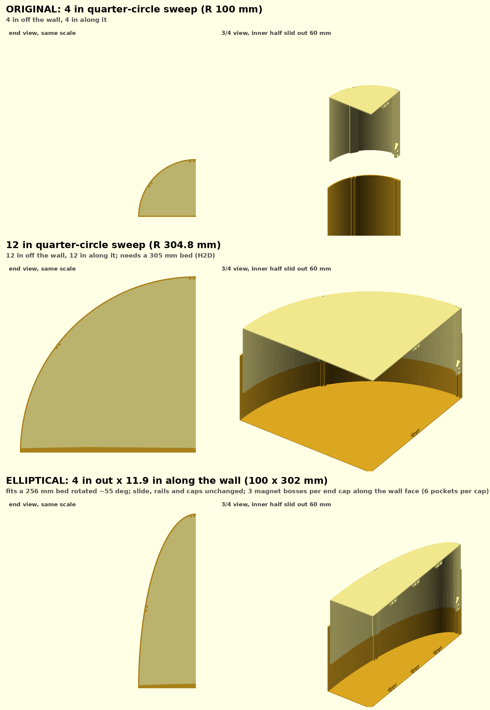

# Vent deflector, long-sweep remixes

Remix of the **6-20 Expandable Vent Cover / Vent Deflector**
([MakerWorld 2722921](https://makerworld.com/en/models/2722921-6-20-expandable-vent-cover-vent-deflector),
6-12" profile, `original/`). The two telescoping halves are kept exactly as
designed: same 6-12" slide, same interlocking rails, same end caps, same magnet
bosses and pockets. Only the **curved sweep of the scoop** is changed; the
original is a 4" quarter circle (R 100 mm).



## Variants (`stl/`)

| Variant | Sweep | Footprint per half | Bed |
|---|---|---|---|
| `vent_deflector_ellipse_302x100_{outer,inner}.stl` | **4" out from the wall, 11.9" (302 mm) along it**, quarter ellipse | 100 × 302 mm, 150 tall | **256 mm bed**, rotate the part ~55° on the plate (outer half's square bbox is 254.4 mm, inner 247 mm). Turn the skirt off or it will be clipped. |
| `vent_deflector_12in_sweep_{outer,inner}.stl` | 12" quarter circle (R 304.8 mm) | 305 × 305 mm, 150 tall | H2D (350 × 320) or larger |

302 mm is the longest quarter-ellipse of this shape that fits a 256 mm bed with
~0.75 mm to spare per side; the full 12" (304.8) misses by 0.4 mm.

Both halves print standing on their end cap, like the original. `outer` is the
original "Right Side", `inner` the "Left Side". Magnets are the original's: Ø6.7 ×
1.9 mm pockets for 6 × 2 mm discs. Each end cap now carries **three** of the
original's cap magnet bosses (two pockets each), spread evenly along the wall face
at 1/4, 1/2 and 3/4 of its length (`CAP_BOSSES` in the script; the original has
one at mid-face). The inner half's hood boss stays at the hood. Per deflector:
12 cap magnets + 2 hood magnets = **14 × 6 × 2 mm discs**.

## Ready-made plate file

`3mf/vent_deflector_ellipse_302x100_256bed.3mf` is a Bambu Studio project with
the outer half on plate 1 and the inner half on plate 2, each already rotated
(145° / 34°) and centred to fit a 256 × 256 plate (0.8 mm and 4.5 mm margin per
side). Select your 256 mm printer in Bambu Studio **before** opening it, open it
as a project, and turn the skirt off. No printer or filament settings are stored
in the file, so your own presets stay. Rebuild with
`python3 make_plate_3mf.py OUT.3mf 256 outer.stl inner.stl`.

## Regenerating

```bash
python3 sweep_remix.py                              # builds both variants above
python3 sweep_remix.py 250 100 ellipse_250x100      # ALONG_mm OUT_mm TAG, any size
```
Needs numpy, trimesh, shapely, manifold3d, rtree. Reads `original/*.3mf`.

## How the stretch works

Mesh-level transform, not a redraw, so nothing the slide depends on was
re-modelled. Both halves go into one frame (shared arc centre, hood at 90°, exit
edge at 180°) and every vertex (r, θ) about that centre maps to
`E(t') + (r − R)·n(t')`: `E` is the new quarter ellipse, `n` its outward normal
(so wall thickness and rail depth are kept exactly), and `t'` comes from an
arc-length map in which the bands holding the hood lip and the mid-arc rails keep
their original arc length while only the plain arc between them stretches. The
flat cap inside is scaled to meet the wall band. Both halves get the identical
map, so the nesting fit is unchanged.

Checks the script runs for every variant: nested-profile overlap at z = 0 and 3D
interference volume at 2 / 60 / 120 mm of slide, compared with the original
(0.012 mm² and ~1 mm³, i.e. rail contact only; ellipse 302×100 gives 0.015 mm²
and 1.85 / 1.12 / 0.37 mm³ vs 1.67 / 1.02 / 0.34); both outputs watertight.

The curvature itself is different, so the rails sit on a flatter wall near the
hood and, for the ellipse, a tighter one (38 mm radius) at the exit edge. Hook
cross-sections are preserved to ~0.2 mm; the 0.19 mm inner/outer radial
clearance is unchanged.
